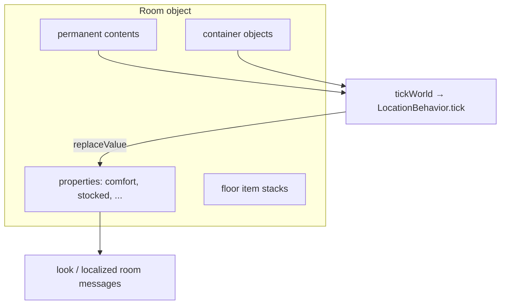

# ADR 0010: Object-first settlements

Status: Proposed

## Context

BrokenRealm is mechanics-first. Settlement state should emerge from **objects and containment** in the world graph, not from hardcoded F# command handlers or singleton world fields.

The vertical slice already demonstrates pieces of this model:

- Player characters are permanent `GameObject` records with `LocationId` containment (ADR 0006).
- Inventory is carried-item stack objects inside players (ADR 0007).
- Room `look` and `tick` dispatch to TypeScript `LocationBehavior` methods.
- Village `comfort` is derived on `tickWorld` from `seating`-tagged permanent contents.
- Containers hold item stacks via the same `transferItem` / `LocationId` containment model as floor and player inventory.

Content expansion (more craft recipes, furniture variety, NPC flavor) should wait until these mechanics and architecture patterns are stable.

During early development there is **no snapshot migration path**. Snapshots must match the current format version exactly; otherwise delete `data/game-snapshot.json` (and backups) and restart for a fresh seed world. Seed-graph reconciliation on load still repairs missing seed modules and incoherent seed-synced sources per ADR 0009.

## Decision

### Settlement unit

For now, a **room object is the settlement unit**. `village` is both a place and the settlement. Do not introduce a separate kernel-level settlement type until multi-room settlements require grouping.

### State lives on objects

1. **Rooms** store durable settlement metrics as typed `properties` (for example `comfort`, `population`, `stocked`).
2. **Permanent contents** (stools, crates, workbenches) are objects in the room with semantic `tags`.
3. **Item stacks** (`carried` tag) live in players, on the room floor, or inside `container`-tagged objects.
4. **Derived metrics** sync from contents during `tickWorld` via neutral `replaceValue` effects — not direct script mutation.

### Tags drive semantics

Use tags as the contract between world objects and behavior logic:

| Tag | Role |
|-----|------|
| `seating` | Contributes to room comfort / ambience |
| `container` | Holds item stacks; supports open / put / take |
| `placeable` | Movable permanent object in a room |
| `storage` | (future) counted toward settlement stocked metric |
| `shelter` | (future) structural / cover contribution |
| `workstation` | (future) object-local production |

Tags are not IDs. Object IDs remain stable per ADR 0001.

### Tick pipeline

`tickWorld` already visits occupied locations and calls `LocationBehavior.tick` with room contents. Extend this pattern rather than adding F# settlement simulators.

### Crafting placement

Short term: player `CRAFT_RECIPES` demonstrates `createObject` placement.

Medium term: move production to **workstation objects** (`use workbench`, `craft stool at workbench`) so `PlayerBehavior` does not accumulate world content definitions.

### Seed vs snapshot

- **Seed modules** (`behaviors/seed/*.ts`) define factory-default behavior patterns (one crate, one stool recipe, etc.).
- **Snapshots** are authoritative per-world state after play.
- Admin-edited modules (`adminEdited` provenance) are never silently overwritten; graph-incoherent seed-synced modules are repaired on hydrate per ADR 0009.

## Implementation phases (mechanics only)

### Phase A — Containment (implemented)

- `transferItem` supports player ↔ container and floor ↔ player.
- `ContainerBehavior` (`open`) and player `put` / `take from`.
- Kernel rejects placing permanent objects inside containers; only item stacks.
- Script context: `this.storedItems`, `actor.containerStorage`.

### Phase B — Derived-property helpers (next)

Extract village tick logic into reusable location utilities:

- `countTaggedContents(context, tag)`
- `syncPropertyIfChanged(context, key, value)` → `replaceValue` effects

**Kernel / scripting touch:** expose aggregated container item totals on **location tick context** (not only on actor), so room ticks can derive `stocked` without ad-hoc actor-scoped reads.

No new room types or recipes in this phase.

### Phase C — Settlement metrics without content bloat

Generalize village tick:

- `comfort` ← count `seating` in contents (existing)
- `stocked` ← any in-room `container` with non-empty `storedItems` (new)

`look` reads properties and emits localized lines; avoid duplicate counting logic in `look` and `tick`.

Prove with existing seeded `village-crate` only — zero new craft recipes.

### Phase D — Workstation objects

- `WorkbenchBehavior` (or similar) owns localized craft patterns.
- Player command targets the object: `craft stool at workbench`.
- Costs read from actor inventory; optional future read from room containers.

Deprecate growth of `CRAFT_RECIPES` on `PlayerBehavior` over time.

### Phase E — Room growth

- `createObject` for new room objects plus `References` exit wiring.
- Player- or admin-placed structures.
- Defer procedural generation.

## Open questions

1. **Container capacity** — enforce via `properties.capacity` on `transferItem`?
2. **Locked containers** — gate `open` on `properties.locked` plus key item or object?
3. **Settlement boundary** — when adding a second village room, parent `settlement` object vs federated room tags?
4. **Admin-edited graph breaks** — remain user-responsible (merge seed) or auto-repair when references are incoherent?

## Consequences

- Settlement feel comes from inspectable object graphs in snapshots and tests.
- New mechanics favor behavior classes + tags + neutral effects over F# command handlers.
- Content teams can add objects later without reopening containment or tick architecture.
- Room property churn stays on the world revision boundary; inventory-only changes stay on player revisions (ADR 0007).

## References

- ADR 0001: object IDs
- ADR 0002: TypeScript behavior classes
- ADR 0007: carried item objects
- ADR 0009: behavior seed lineage and reconciliation